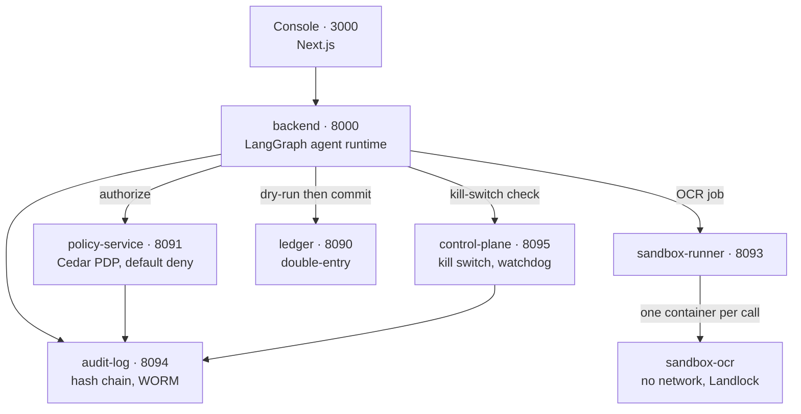
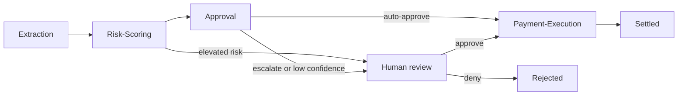

# VeriSettle

AI agents read invoices, score them for fraud, route approvals, and pay the safe ones — inside six governance layers that can prove, afterwards, exactly what happened and why.

Giving an agent authority to move money is where a mistake stops being a bug and becomes a financial loss. So the interesting part is not the agents; it is that every control around them does real work:

- **Nothing is mocked.** Real invoices (CORD, SROIE) with real ground-truth labels, real vendors and payment history from the USAspending.gov API, and a promotion gate that a genuinely worse prompt genuinely fails.
- **The one thing that cannot be real** — a bank wire — is a full double-entry ledger instead, the same sandboxed settlement pattern used before going live.
- **Every layer is independently provable.** [`docs/scenarios/`](docs/scenarios/) has one runnable proof per control, each showing something correctly blocked, not just working.

Runs entirely on Docker Desktop. The only traffic leaving your machine goes to OpenAI and Groq.

**Getting it running** — [Prerequisites](#1-prerequisites) · [API keys](#2-get-the-two-api-keys) · [First run](#3-first-run) · [Services and logins](#4-services-and-logins) · [Confirm it worked](#5-confirm-it-worked) · [Troubleshooting](#6-troubleshooting)

**Understanding it** — [How it works](#how-it-works) · [Governance layers](#the-six-governance-layers) · [Repository structure](#repository-structure) · [Development](#development)

For a slower, hand-held version of the first run — what each command prints, what to paste where, what to do when one fails — see [`docs/getting-started.md`](docs/getting-started.md).

---

## 1. Prerequisites

| Need | Detail |
|---|---|
| **Docker Desktop** 4.90 or newer | Everything is a container. Nothing runs on your host. |
| **Memory allocated to Docker** | **10 GB** runs the governance path. **20 GB** also runs OpenMetadata, Presidio and Langfuse. See the note below before choosing. |
| ~25 GB free disk, 4+ CPU cores | Image size and build headroom. The images total roughly 20 GB. |
| `make` and a POSIX shell | Ships with macOS and Linux; Git Bash on Windows. |
| **`infisical` CLI, v0.43 or newer** | Step 2 drives it directly. `brew install infisical/get-cli/infisical`. Older versions fail with `unknown flag: --email` — the CLI moved to its own repo at 0.43 and the login flags changed. |
| An OpenAI key and a Groq key | There is no offline or mocked model path. |
| `uv` | Optional, only for working on the Python code locally. |

**About the memory number.** Declared container limits sum to **25.2 GiB across ~35 containers** for the full stack, and about **10.7 GiB** for the governance path that `make step6` brings up. Those are ceilings, not reservations, so the stack does not need 25 GB of real memory to run — but under-allocating does not produce a clear error. It produces a container that is SIGKILLed during startup, restarts, and is killed again, logging nothing at all. [Troubleshooting](#6-troubleshooting) has the exact recipe for identifying that.

On Windows, set `memory=20GB` in `%UserProfile%\.wslconfig`, then `wsl --shutdown`.

---

## 2. Get the two API keys

| Key | Where | Goes in `.env` as |
|---|---|---|
| OpenAI | [platform.openai.com/api-keys](https://platform.openai.com/api-keys) | `OPENAI_API_KEY=sk-...` |
| Groq | [console.groq.com/keys](https://console.groq.com/keys) | `GROQ_API_KEY=gsk_...` |

OpenAI serves the reasoning tier — fraud judgment and any payment decision above the routine-amount threshold. Groq serves the routine tier and the guardrail classifier. Using two providers is deliberate: the adversarial critic that reviews an approval decision runs on the *other* provider from the one that made it.

Both keys are used through LiteLLM, never by an agent directly. No agent ever holds a provider key — only a virtual key scoped to the model routes its own capability manifest allows, with a real per-day budget cap.

---

## 3. First run

### Generate your environment

```sh
make env
```

Writes `.env` with a fresh value for every local secret. There is no `.env.example` to copy — the layout lives in the generator, so no env file is ever committed and every clone gets its own secrets. It refuses to overwrite an existing `.env`, because once the stack has run, those values are baked into your volumes.

Now put your two API keys into `.env`. Every other value is already filled in. [`docs/secrets-reference.md`](docs/secrets-reference.md) explains what each generated secret is and why it is the length it is.

### Bring it up

Three commands, because it stops twice **on purpose**: two provisioning scripts print values that a human must paste into `.env`. Each stop names the exact variables and the next command. Nothing pretends to be automatic that isn't.

```sh
make bootstrap          # steps 0-2, then stops
#   -> paste INFISICAL_PROJECT_ID, PAYMENT_EXECUTION_CLIENT_ID,
#      PAYMENT_EXECUTION_CLIENT_SECRET into .env

make bootstrap-data     # steps 3-4a, then stops
#   -> paste the four LITELLM_KEY_AGENT_* values into .env
#   -> also set LITELLM_EXTRACTION_KEY to the extraction key (see below)

make bootstrap-finish   # eval gate, policy check, app layer, sandbox image
```

`bootstrap-finish` runs the DeepEval promotion gate first, which makes **real paid LLM calls**. A small bill, but not zero.

**One value the script does not fill in.** `provision-litellm-keys.py` prints the four `LITELLM_KEY_AGENT_*` values but does not write `LITELLM_EXTRACTION_KEY`, despite `generate-env.sh` labelling it auto-filled. Left empty, the eval gate silently falls back to `LITELLM_MASTER_KEY` and runs unscoped and unbudgeted. Set it to the same value as `LITELLM_KEY_AGENT_EXTRACTION`.

### Or step by step

Every step is individually re-runnable, which is what you want when one fails halfway.

| Command | Does | Move on when |
|---|---|---|
| `make step0` | Docker network, renders the Keycloak realm from `.env` | Returns immediately |
| `make step1` | Postgres, MinIO, the seven service databases | Both `healthy`, and the database guard prints all seven |
| `make step2` | Keycloak, SPIRE, Infisical; 6 SPIRE entries, agent join token, vault admin, service identities | **Prints 3 values to paste into `.env`** |
| `make step3` | OpenMetadata, Presidio; loads real invoices and vendors; tags tables sensitive | Loader exits 0 — a few minutes |
| `make step4-keys` | LiteLLM, MLflow; one budget-capped key per agent | **Prints the `LITELLM_KEY_AGENT_*` values to paste** |
| `make eval-gate` | Grades two real prompts against held-out ground truth; promotes one, blocks the other | Prints one `PROMOTED` and one `BLOCKED` |
| `make step5` | Validates the Cedar rulebook | Prints `ACCEPTED` |
| `make step6` | Agent runtime, ledger, PDP, audit log, kill switch, console, dashboards | All `healthy` |
| `make step6-full` | The same plus Langfuse tracing | Needs the full 20 GB allocation |
| `make sandbox-image` | Builds the OCR sandbox | Required before any image upload works |

`make step6` deliberately names the services it starts rather than starting everything, so it fits a normal machine. `make step6-full` is the everything version.

---

## 4. Services and logins

> **Local development only.** Every credential here is generated by `make env` on your machine and exists nowhere else. None of it is a real account.

```sh
make urls    # prints all of these with your ports
```

| Service | URL | Credential |
|---|---|---|
| **VeriSettle Console** | localhost:3000 | Keycloak users `ap.clerk.demo`, `controller.demo`, `cfo.demo` — passwords are the `DEMO_*_PASSWORD` values in `.env` |
| Keycloak admin | localhost:8180/admin | `KEYCLOAK_ADMIN` / `KEYCLOAK_ADMIN_PASSWORD` |
| Infisical | localhost:8443 | `INFISICAL_ADMIN_EMAIL` / `INFISICAL_ADMIN_PASSWORD` |
| MinIO console | localhost:9001 | `MINIO_ROOT_USER` / `MINIO_ROOT_PASSWORD` |
| LiteLLM | localhost:4000/ui | `LITELLM_MASTER_KEY` |
| MLflow | localhost:5500 | none, local only |
| OpenMetadata | localhost:8585 | `admin@open-metadata.org` / `admin` — its own default |
| Langfuse | localhost:3010 | `INFISICAL_ADMIN_EMAIL` / `LANGFUSE_INIT_USER_PASSWORD` |
| Prometheus | localhost:9095 | none |
| Grafana | localhost:3020 | `admin` / `GRAFANA_ADMIN_PASSWORD` |

The three console logins have deliberately different approval authority: only the CFO account clears the high-value threshold. That is the point — the Cedar policy, not the UI, decides.

### Internal services

| Service | Port | Owns |
|---|---|---|
| `backend` | 8000 | The agent graph, guardrail, PII redaction, tracing |
| `ledger` | 8090 | Double-entry bookkeeping, balances, vendor history |
| `policy-service` | 8091 | Cedar + temporal authorization, default deny |
| `sandbox-runner` | 8093 | Dispatching sandboxed OCR jobs |
| `audit-log` | 8094 | Hash chain, WORM storage, `/verify`, tamper watchdog |
| `control-plane` | 8095 | Kill switch scopes, heartbeat watchdog |

---

## 5. Confirm it worked

```sh
make ps        # every container and its status
make health    # backend health, including the SPIFFE ID it actually fetched
```

**What healthy looks like.** Most containers show `Up (healthy)`. Two categories correctly do not:

- **`Exited (0)`** — the one-shot jobs, and this is success: `postgres-init`, `minio-init`, `spire-server-data-init`, `spire-agent-data-init`, `data-loader`, `deepeval-gate`.
- **`Up` with no health status** — `spire-agent` has no healthcheck defined. `Up` is all you get, and it is fine.

Anything showing `Up 10 seconds` when its neighbours show hours is restart-looping. Go to [Troubleshooting](#6-troubleshooting).

### First-run checklist

Six things worth confirming once, because each one fails quietly rather than loudly:

```sh
# 1. All seven service databases exist (this one has genuinely failed before)
sh infra/scripts/verify-service-databases.sh

# 2. The Keycloak realm was seeded - the three demo users must exist
open http://localhost:8180/admin   # Realm "verisettle" > Users

# 3. The Cedar rulebook validates
make validate-policies             # expects ACCEPTED

# 4. LiteLLM can reach both providers
curl -s -H "Authorization: Bearer $LITELLM_MASTER_KEY" \
  http://localhost:4000/health | python3 -m json.tool

# 5. The data loader actually loaded. Expected real counts:
#      500 invoices - CORD 150 train + 40 test, SROIE 250 train + 60 test
#      300 historical payments across 159 vendors
docker exec -i verisettle-postgres psql -U verisettle_backend -d verisettle_backend \
  -c "SELECT source, split, count(*) FROM invoices GROUP BY source, split ORDER BY 1,2;"

# 6. OpenMetadata has the real catalog entries (only if you ran step3 in full)
open http://localhost:8585         # search for "invoices"
```

Then submit an invoice. Open **localhost:3000**, sign in, and use **Submit** — pasted OCR text is fast and skips OCR; an image upload goes through the sandbox. Five test invoices are in [`docs/sample-invoices/`](docs/sample-invoices/): clean, first-time vendor with a large amount, prompt-injection attempt, PII-heavy, and suspicious round number. [`docs/testing-your-own-invoice.md`](docs/testing-your-own-invoice.md) covers using your own.

### Prove the guardrails

Start at [`docs/scenarios/01-end-to-end-happy-path.md`](docs/scenarios/01-end-to-end-happy-path.md), then work through the layers that would have stopped it. Shortcuts for the checks those docs run by hand:

```sh
make verify-audit         # two-stage chain + WORM content verification
make kill-switch-status   # paused agents, halted threads, global stop
make validate-policies    # the real Cedar validator
```

---

## 6. Troubleshooting

Real failure modes, with the real symptom.

### A container will not stay up

This is the one that costs hours, so it gets its own section.

**Symptom:** `make ps` shows `Up 10 seconds` for one service while everything else shows hours. `docker logs` is completely empty.

**Do not** read `docker inspect ... .State.ExitCode` or `.State.OOMKilled` while the container is running or restarting. Those fields describe the *current* state and read `0` and `false` no matter how the last run ended. They will send you in the wrong direction.

**Do this instead:**

```sh
docker inspect <container> --format '{{.RestartCount}}'
sh infra/scripts/compose.sh run --rm <service>; echo "exit=$?"
```

The second command runs the service in the foreground with the real compose configuration and gives you a true exit code.

| Exit code | Means | Fix |
|---|---|---|
| `137` | SIGKILL — almost always memory | Raise that service's `deploy.resources.limits.memory`, or stop other containers to free VM memory. Note this is the container's own cap: raising Docker Desktop's total allocation does nothing for a service capped below what it needs. |
| Anything else | A real error | It will now be in the foreground output that the restart loop was hiding |

**Why the logs were empty:** Python block-buffers stdout when it is not a TTY. A SIGKILL discards the buffer, so a memory kill produces no output at all. Absence of logs is a symptom *of* being killed, not evidence against it.

### Everything else

| Symptom | Cause | Fix |
|---|---|---|
| `./.env: of: not found` from any script | An unquoted value in `.env` — a bare space makes `sh` read the next word as a command | Quote the value. `generate-env.sh` quotes them now |
| Container is `healthy` but unreachable from the host | Its healthcheck runs inside its own netns and stays green even when Docker Desktop's port forwarding didn't come back | `make restart SERVICE=<name>` |
| Keycloak or Infisical crash-loops on `role ... does not exist` | The service databases were never created — Postgres reported healthy with no databases in them | `sh infra/scripts/verify-service-databases.sh`, then re-run `make step1` |
| `spire-agent` crash-loops on `join token ... already been used` | Join-token attestation is single-use. Correct fail-closed behaviour, not a bug | `sh infra/scripts/setup-spire.sh` then `make restart SERVICE=spire-agent` |
| `infisical: unknown flag: --email` | CLI older than 0.43 | `brew upgrade infisical` |
| Every bind mount breaks at once (Windows) | An idle Docker Desktop VM wedges WSL2's mount tree at drive-root level; survives restart and `--force-recreate` | `wsl --shutdown`, reopen Docker Desktop, `make up` |
| Langfuse fails after Postgres was recreated | Its Prisma pool doesn't survive the database being replaced, unlike the Python services | `make restart SERVICE=langfuse-web` and `langfuse-worker` |
| `make env` refuses to run | A `.env` exists and its secrets are in your volumes | `make clean`, then `FORCE=1 make env` |

---
---

# Understanding it

Everything above gets it running. Everything below explains what it is doing.

## How it works



Every consequential action is authorized at the point it happens, and re-checked at the next step rather than trusting the previous one. The kill switch lives **outside** the agent runtime on purpose: a malfunctioning agent must never be the thing deciding whether it gets stopped.

### How an invoice flows



A LangGraph state machine with Postgres checkpointing, so a run can pause for a human and resume hours later.

| Step | What it does | The control that matters |
|---|---|---|
| **Extraction** | OCR text or an uploaded image into a typed, schema-validated invoice | Prompt loaded from the MLflow registry at the `production` alias, never hardcoded. Images go through the sandbox. |
| **Risk-Scoring** | Scores fraud and anomaly risk | Asks the ledger what it actually knows about the vendor. Never accepts a client-supplied "known vendor" flag — that would let anyone bypass the first-seen rule by asserting it. |
| **Approval** | Auto-approve, escalate, or reject | Carries a numeric confidence; below threshold a human is required regardless. A second model from **the other provider** then reviews it adversarially. |
| **Human review** | Real graph interrupt, resumed from the console | Keycloak role decides what you may approve. |
| **Payment-Execution** | Moves the money | The gate chain below. |

### The six payment gates

The last one is the point of the whole design.

1. **Capability manifest** — only this agent's manifest contains `CreateLedgerEntry`
2. **Cedar authorization** — default deny
3. **Dry-run** against the real ledger, in a transaction that always rolls back, sharing the exact validation code the real commit uses
4. **Settlement hold** — a configurable cooling-off window
5. **Fresh kill-switch re-check after the hold** — a trip during that window blocks a payment every agent already agreed to
6. **Double-entry commit** with idempotency-key duplicate detection, then the vendor-history update that only happens on a genuine settlement

Escalation to a human is triggered by any of: a first-seen vendor, decision confidence below 0.75, or an amount above the auto-approval threshold.

---

## The six governance layers

| Layer | Tools | Enforces |
|---|---|---|
| **Identity** | Keycloak, SPIFFE/SPIRE, Infisical | Roles tied to approval tiers. The backend fetches an X.509 SVID **at import time** — no identity, the container dies before serving traffic. Ledger credentials fetched fresh per use, never cached or written to disk. |
| **Data** | OpenMetadata, Presidio, Great Expectations | Tables tagged `RestrictedFinancial`. PII stripped before any durable write. A quality checkpoint with its own self-test. |
| **Model** | LiteLLM, MLflow, DeepEval | One gateway for every call; one key per agent with a model allowlist and a budget cap enforced *before* the call goes out. Prompts are versioned artifacts graded against held-out ground truth. |
| **Policy** | Cedar, Dogwood | `policies/` is the source of truth, validated before it is trusted. |
| **Agent Runtime** | LangGraph, Cedar PDP, guardrail model, Landlock | Default-deny at every step. Guardrail catches prompt injection *and* business-fraud phrasing. OCR runs with no network, read-only root, all caps dropped, plus a kernel-enforced Landlock ruleset. |
| **Operations** | OpenTelemetry, Langfuse, Prometheus, Grafana | Hash-chained audit log in WORM storage that root cannot rewrite, verified by recomputing the chain *and* byte-comparing stored objects. A watchdog runs that check continuously, so a tamper reverted before anyone looks is still permanently provable. |

---

## Repository structure

```
services/                       every deployable service
  backend/                      FastAPI + LangGraph agent runtime
    app/graph.py                  the state machine and its routing
    app/nodes/                    the four agents: extraction, risk_scoring,
                                  approval, payment_execution
    app/capability-manifests/     one JSON per agent - the second, independent
                                  authorization check alongside Cedar
    app/schemas.py                Instructor-validated LLM output types
    app/policy_client.py          calls the PDP before consequential actions
    app/ledger_client.py          brokers the ledger credential fresh per use
    app/identity.py               fetches the SPIFFE SVID at import time
    app/guardrail.py              classifier over untrusted invoice content
    app/pii.py                    Presidio redaction before durable writes
    app/tracing.py                OpenTelemetry GenAI spans
  ledger/                       double-entry ledger, vendors, payment history
    app/ledger.py                 validation shared by dry-run and commit
    app/models.py                 accounts, transactions, entries, vendors
  policy-service/               Policy Decision Point
    app/cedar_engine.py           the real Cedar engine
    app/temporal.py               rate/time-window rules Cedar cannot express
  control-plane/                kill switch, graduated scopes, heartbeat watchdog
  audit-log/                    hash-chained WORM log + continuous tamper watchdog
  data-loader/                  one-shot, re-runnable real-data seeding
    loader/load_invoices.py       CORD + SROIE
    loader/load_vendors.py        USAspending.gov awards
    loader/validate.py            Great Expectations checkpoint
  sandbox-runner/               launches one throwaway OCR container per call
  sandbox-ocr/                  that container: no network, read-only root,
                                all caps dropped, plus a Landlock ruleset

apps/console/                   Next.js dashboard
  app/submit/                     paste OCR text or upload a real image
  app/approvals/                  the human-in-the-loop queue
  app/audit/                      chain viewer with a live verify button
  app/ledger/  app/policies/  app/kill-switch/

policies/                       the authorization source of truth
  01-agent-approval-threshold.cedar         no agent auto-approves above the limit
  02-first-seen-vendor-dual-approval.cedar  new vendor always needs a human
  03-payment-execution-exclusive-ledger-write.cedar
  04-tool-allowlist.cedar                   per-agent, default deny
  05-flagging-and-documentation-actions.cedar
  temporal/                                 rolling-window rate limits

infra/
  compose/                      six compose files, one per governance layer,
                                each runnable standalone
  scripts/                      generate-env, compose wrapper, SPIRE, Infisical,
                                LiteLLM keys, OpenMetadata catalog, Cedar validator
  deepeval/                     the one-shot prompt promotion gate
  keycloak/ spire/ litellm/ mlflow/ prometheus/ grafana/ minio-init/ postgres-init/

docs/
  getting-started.md            the guided first run, in detail
  secrets-reference.md          what every generated secret is, and why its length
  scenarios/                    one runnable proof per governance control
  sample-invoices/              generator for five real test invoices

pyproject.toml                  uv workspace root + shared dev tooling
uv.lock                         one resolved lock for every workspace service
Makefile                        developer entry point - make help
```

---

## Development

The Python services are a **uv workspace** — one lock, one resolution, each service declaring its own dependencies. No `requirements.txt` anywhere.

```sh
make sync       # local dev environment from the lock
make check      # lint + typecheck + test
make lock       # re-resolve after changing a dependency
make help       # every target
```

Two jobs sit outside the workspace with their own locks, for reasons worth knowing:

- **`services/sandbox-ocr`** — the process that parses untrusted documents. Out of the shared resolution so nothing another service pulls in can widen its dependency surface.
- **`infra/deepeval`** — a genuine conflict: deepeval pins `click<8.4.0`, `huggingface-hub` needs `click>=8.4.0`. They cannot share one resolution, so they don't pretend to.

Service images build from a repo-root context to see the workspace lock and install with `uv sync --frozen`, which fails the build rather than resolving something the lock doesn't describe.

`make validate-policies` uses your host `python3` when it can import `cedarpy`, and otherwise runs the validator in a throwaway container — `cedarpy` is a `policy-service` dependency, not a host one, and macOS ships a Python with no wheel for it.

---

## Honest limitations

Documented rather than hidden.

SPIRE attests one identity per OS process and the four agents are function calls in one process, so per-agent separation is enforced by Cedar and the capability manifests instead. A self-hosted Langfuse may not price internal route names even though token counts are captured correctly. Policy validation is run manually per this README — there is no CI here, and nothing implies one.

Amounts carry no currency. The invoice corpora are Malaysian ringgit (SROIE) and Indonesian rupiah (CORD), the auto-approval threshold is defined in dollars, and the vendor payment history comes from USAspending in dollars. Whether this produces wrong comparisons in practice is under investigation and is **not yet resolved** — see the project notes before relying on any amount-based decision.

[`INSTRUCTIONS.md`](INSTRUCTIONS.md) is the full specification, including every trade-off made deliberately and what the real failure tests actually revealed.
