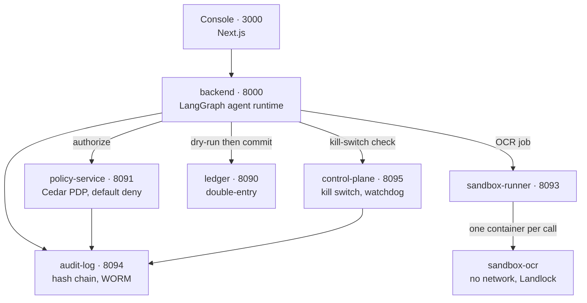
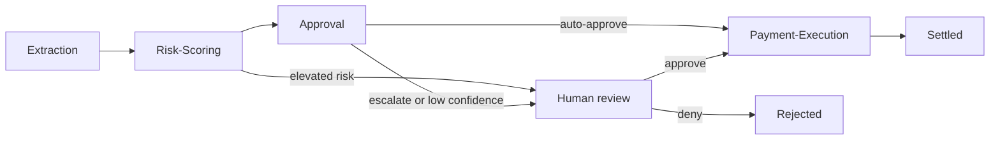

# VeriSettle

AI agents read invoices, score them for fraud, route approvals, and pay the safe ones — inside six governance layers that can prove, afterwards, exactly what happened and why.

Giving an agent authority to move money is where a mistake stops being a bug and becomes a financial loss. So the interesting part is not the agents; it is that every control around them does real work:

- **Nothing is mocked.** Real invoices (CORD, SROIE) with real ground-truth labels, real vendors and payment history from the USAspending.gov API, and a promotion gate that a genuinely worse prompt genuinely fails.
- **The one thing that cannot be real** — a bank wire — is a full double-entry ledger instead, the same sandboxed settlement pattern used before going live.
- **Every layer is independently provable.** [`docs/scenarios/`](docs/scenarios/) has one runnable proof per control, each showing something correctly blocked, not just working.

Runs entirely on Docker Desktop. The only traffic leaving your machine goes to OpenAI and Groq.

**Contents** — [Architecture](#architecture) · [Repository structure](#repository-structure) · [Governance layers](#governance-layers) · [Setup](#setup) · [Using it](#using-it) · [Development](#development) · [Troubleshooting](#troubleshooting)

---

## Architecture



Every consequential action is authorized at the point it happens, and re-checked at the next step rather than trusting the previous one. The kill switch lives **outside** the agent runtime on purpose: a malfunctioning agent must never be the thing deciding whether it gets stopped.

### How an invoice flows



A LangGraph state machine with Postgres checkpointing, so a run can pause for a human and resume hours later.

| Step | What it does | The control that matters |
|---|---|---|
| **Extraction** | OCR text or an uploaded image into a typed, schema-validated invoice | Prompt loaded from the MLflow registry at the `production` alias, never hardcoded. Images go through the sandbox. |
| **Risk-Scoring** | Scores fraud and anomaly risk | Asks the ledger what it actually knows about the vendor. Never accepts a client-supplied "known vendor" flag — that would let anyone bypass the first-seen rule by asserting it. |
| **Approval** | Auto-approve, escalate, or reject | Carries a numeric confidence; below threshold a human is required regardless. A second model from **the other provider** then reviews it adversarially. |
| **Human review** | Real graph interrupt, resumed from the console | Keycloak role decides what you may approve. |
| **Payment-Execution** | Moves the money | The gate chain below. |

Payment-Execution runs six gates in order, and the last one is the point of the whole design:

1. Capability manifest — only this agent's manifest contains `CreateLedgerEntry`
2. Cedar authorization — default deny
3. **Dry-run** against the real ledger, in a transaction that always rolls back, sharing the exact validation code the real commit uses
4. **Settlement hold** — a configurable cooling-off window
5. **Fresh kill-switch re-check after the hold** — a trip during that window blocks a payment every agent already agreed to
6. Double-entry commit with idempotency-key duplicate detection, then the vendor-history update that only happens on a genuine settlement

---

## Repository structure

```
services/                       every deployable service
  backend/                      FastAPI + LangGraph agent runtime
    app/graph.py                  the state machine and its routing
    app/nodes/                    the four agents: extraction, risk_scoring,
                                  approval, payment_execution
    app/capability-manifests/     one JSON per agent - the second, independent
                                  authorization check alongside Cedar
    app/schemas.py                Instructor-validated LLM output types
    app/policy_client.py          calls the PDP before consequential actions
    app/ledger_client.py          brokers the ledger credential fresh per use
    app/identity.py               fetches the SPIFFE SVID at import time
    app/guardrail.py              classifier over untrusted invoice content
    app/pii.py                    Presidio redaction before durable writes
    app/tracing.py                OpenTelemetry GenAI spans
  ledger/                       double-entry ledger, vendors, payment history
    app/ledger.py                 validation shared by dry-run and commit
    app/models.py                 accounts, transactions, entries, vendors
  policy-service/               Policy Decision Point
    app/cedar_engine.py           the real Cedar engine
    app/temporal.py               rate/time-window rules Cedar cannot express
  control-plane/                kill switch, graduated scopes, heartbeat watchdog
  audit-log/                    hash-chained WORM log + continuous tamper watchdog
  data-loader/                  one-shot, re-runnable real-data seeding
    loader/load_invoices.py       CORD + SROIE
    loader/load_vendors.py        USAspending.gov awards
    loader/validate.py            Great Expectations checkpoint
  sandbox-runner/               launches one throwaway OCR container per call
  sandbox-ocr/                  that container: no network, read-only root,
                                all caps dropped, plus a Landlock ruleset

apps/console/                   Next.js dashboard
  app/submit/                     paste OCR text or upload a real image
  app/approvals/                  the human-in-the-loop queue
  app/audit/                      chain viewer with a live verify button
  app/ledger/  app/policies/  app/kill-switch/

policies/                       the authorization source of truth
  01-agent-approval-threshold.cedar         no agent auto-approves above the limit
  02-first-seen-vendor-dual-approval.cedar  new vendor always needs a human
  03-payment-execution-exclusive-ledger-write.cedar
  04-tool-allowlist.cedar                   per-agent, default deny
  05-flagging-and-documentation-actions.cedar
  temporal/                                 rolling-window rate limits

infra/
  compose/                      six compose files, one per governance layer,
                                each runnable standalone
  scripts/                      generate-env, compose wrapper, SPIRE, Infisical,
                                LiteLLM keys, OpenMetadata catalog, Cedar validator
  deepeval/                     the one-shot prompt promotion gate
  keycloak/ spire/ litellm/ mlflow/ prometheus/ grafana/ minio-init/ postgres-init/

docs/
  scenarios/                    one runnable proof per governance control
  sample-invoices/              generator for five real test invoices

pyproject.toml                  uv workspace root + shared dev tooling
uv.lock                         one resolved lock for every workspace service
Makefile                        developer entry point - make help
```

### Services

| Service | Port | Owns |
|---|---|---|
| `backend` | 8000 | The agent graph, guardrail, PII redaction, tracing |
| `ledger` | 8090 | Double-entry bookkeeping, balances, vendor history |
| `policy-service` | 8091 | Cedar + temporal authorization, default deny |
| `sandbox-runner` | 8093 | Dispatching sandboxed OCR jobs |
| `audit-log` | 8094 | Hash chain, WORM storage, `/verify`, tamper watchdog |
| `control-plane` | 8095 | Kill switch scopes, heartbeat watchdog |
| `console` | 3000 | The browser UI |

---

## Governance layers

| Layer | Tools | Enforces |
|---|---|---|
| **Identity** | Keycloak, SPIFFE/SPIRE, Infisical | Roles tied to approval tiers. The backend fetches an X.509 SVID **at import time** — no identity, the container dies before serving traffic. Ledger credentials fetched fresh per use, never cached or written to disk. |
| **Data** | OpenMetadata, Presidio, Great Expectations | Tables tagged `RestrictedFinancial`. PII stripped before any durable write. A quality checkpoint with its own self-test. |
| **Model** | LiteLLM, MLflow, DeepEval | One gateway for every call; one key per agent with a model allowlist and a budget cap enforced *before* the call goes out. Prompts are versioned artifacts graded against held-out ground truth. |
| **Policy** | Cedar, Dogwood | `policies/` is the source of truth, validated before it is trusted. |
| **Agent Runtime** | LangGraph, Cedar PDP, guardrail model, Landlock | Default-deny at every step. Guardrail catches prompt injection *and* business-fraud phrasing. OCR runs with no network, read-only root, all caps dropped, plus a kernel-enforced Landlock ruleset. |
| **Operations** | OpenTelemetry, Langfuse, Prometheus, Grafana | Hash-chained audit log in WORM storage that root cannot rewrite, verified by recomputing the chain *and* byte-comparing stored objects. A watchdog runs that check continuously, so a tamper reverted before anyone looks is still permanently provable. |

---

## Setup

### Prerequisites

| Need | Why |
|---|---|
| Docker Desktop, **20GB RAM allocated** | Steady state is ~9-10GB, but Keycloak, SPIRE, Infisical, OpenMetadata, Langfuse and the runtime all run together. Windows: set `memory=20GB` in `%UserProfile%\.wslconfig`, then `wsl --shutdown`. |
| ~25GB disk, 6+ CPU cores | Image size and build headroom |
| `make`, and a POSIX shell | Ships with macOS/Linux; Git Bash on Windows |
| An OpenAI key and a Groq key | No offline or mocked model path exists |
| `uv` (optional) | Only for working on the Python code locally |

### 1. Generate your environment

```sh
make env
```

Writes `.env` with a fresh value for every local secret. There is no `.env.example` to copy — the layout lives in the generator, so no env file is ever committed and every clone gets its own secrets. It refuses to overwrite an existing `.env`, because once the stack has run those values are baked into your volumes.

Then set the two real keys in `.env`:

```
OPENAI_API_KEY=sk-...      # platform.openai.com/api-keys
GROQ_API_KEY=gsk_...       # console.groq.com/keys
```

### 2. Bring it up

```sh
make bootstrap          # steps 0-2, then stops
make bootstrap-data     # steps 3-4a, then stops
make bootstrap-finish   # eval gate, policy check, full stack, sandbox image
```

It stops twice **on purpose**: two provisioning scripts print values that a human must paste into `.env`. Each stop names the exact variables and the next command. Nothing pretends to be automatic that isn't.

Every step is also individually re-runnable, which is what you want when one fails halfway:

| Command | Does | Done when |
|---|---|---|
| `make step0` | Docker network, renders the Keycloak realm from `.env` | instant |
| `make step1` | Postgres, MinIO | both `healthy` |
| `make step2` | Keycloak, SPIRE, Infisical; 6 SPIRE entries, agent join token, vault admin, service identities | **prints 3 values to paste into `.env`** |
| `make step3` | OpenMetadata, Presidio; loads real invoices and vendors; tags tables sensitive | loader exits 0, a few minutes |
| `make step4-keys` | LiteLLM, MLflow; one budget-capped key per agent | **prints the `LITELLM_KEY_AGENT_*` values to paste** |
| `make eval-gate` | Grades two real prompts; promotes one, blocks the other | makes real paid LLM calls |
| `make step5` | Validates the Cedar rulebook | prints `ACCEPTED` |
| `make step6` | Agent runtime, ledger, PDP, audit log, kill switch, console, dashboards | all `healthy` |
| `make sandbox-image` | Builds the OCR sandbox | needed before any image upload works |

### 3. Confirm

```sh
make ps        # every container and its status
make health    # backend health, including the SPIFFE ID it actually fetched
make urls      # every browser-facing URL
```

A couple of one-shot jobs show `Exited (0)` rather than `healthy` — that is correct.

---

## Using it

Open **http://localhost:3000** and sign in through Keycloak as `ap.clerk.demo`, `controller.demo` or `cfo.demo`. Their approval authority differs deliberately: only the CFO account clears the high-value threshold. Passwords are the `DEMO_*_PASSWORD` values in your `.env`.

The console gives you the live pipeline with the policy decision at each step, the approval queue, the audit viewer with a real verify button, ledger balances and per-agent spend against budget, the kill switch, and a policy explorer.

The **Submit** page takes pasted OCR text (fast, skips OCR) or a real image upload (goes through the sandbox). Five test invoices are in `docs/sample-invoices/`: clean, first-time vendor with a large amount, prompt-injection attempt, PII-heavy, and suspicious round number. See [`docs/testing-your-own-invoice.md`](docs/testing-your-own-invoice.md) for your own.

### Logins

`make urls` prints every URL. Credentials are whatever `make env` generated on your machine — nothing to look up, nothing to leak.

| Page | URL | Credential |
|---|---|---|
| VeriSettle Console | localhost:3000 | Keycloak demo users, `DEMO_*_PASSWORD` |
| Keycloak admin | localhost:8180/admin | `KEYCLOAK_ADMIN` / `KEYCLOAK_ADMIN_PASSWORD` |
| Infisical | localhost:8443 | `INFISICAL_ADMIN_EMAIL` / `INFISICAL_ADMIN_PASSWORD` |
| MinIO console | localhost:9001 | `MINIO_ROOT_USER` / `MINIO_ROOT_PASSWORD` |
| LiteLLM | localhost:4000/ui | `LITELLM_MASTER_KEY` |
| MLflow | localhost:5500 | none, local only |
| OpenMetadata | localhost:8585 | `admin@open-metadata.org` / `admin` — its own default |
| Langfuse | localhost:3010 | `INFISICAL_ADMIN_EMAIL` / `LANGFUSE_INIT_USER_PASSWORD` |
| Prometheus | localhost:9095 | none |
| Grafana | localhost:3020 | `admin` / `GRAFANA_ADMIN_PASSWORD` |

### Prove the guardrails

Start at [`docs/scenarios/01-end-to-end-happy-path.md`](docs/scenarios/01-end-to-end-happy-path.md), then work through the layers that would have stopped it. Shortcuts for the checks those docs run by hand:

```sh
make verify-audit         # two-stage chain + WORM content verification
make kill-switch-status   # paused agents, halted threads, global stop
make validate-policies    # the real Cedar validator
```

---

## Development

The Python services are a **uv workspace** — one lock, one resolution, each service declaring its own dependencies. No `requirements.txt` anywhere.

```sh
make sync       # local dev environment from the lock
make check      # lint + typecheck + test
make lock       # re-resolve after changing a dependency
make help       # every target
```

Two jobs sit outside the workspace with their own locks, for reasons worth knowing:

- **`services/sandbox-ocr`** — the process that parses untrusted documents. Out of the shared resolution so nothing another service pulls in can widen its dependency surface.
- **`infra/deepeval`** — a genuine conflict: deepeval pins `click<8.4.0`, `huggingface-hub` needs `click>=8.4.0`. They cannot share one resolution, so they don't pretend to.

Service images build from a repo-root context to see the workspace lock and install with `uv sync --frozen`, which fails the build rather than resolving something the lock doesn't describe.

---

## Troubleshooting

Real failure modes, not generic advice.

| Symptom | Cause | Fix |
|---|---|---|
| Container is `healthy` but unreachable from the host | Its healthcheck runs inside its own netns and stays green even when Docker Desktop's port forwarding didn't come back | `make restart SERVICE=<name>` |
| Every bind mount breaks at once (Windows) | An idle Docker Desktop VM wedges WSL2's mount tree at drive-root level; survives restart and `--force-recreate` | `wsl --shutdown`, reopen Docker Desktop, `make up` |
| Langfuse fails after Postgres was recreated | Its Prisma pool doesn't survive the database being replaced, unlike the Python services | `make restart SERVICE=langfuse-web` and `langfuse-worker` |
| `spire-agent` crash-loops on "join token ... already been used" | Join-token attestation is single-use. Correct fail-closed behaviour, not a bug | `sh infra/scripts/setup-spire.sh` then `make restart SERVICE=spire-agent` |
| LiteLLM `/health/liveliness` returns empty | Still migrating | Re-run until you get a reply |
| `make env` refuses to run | A `.env` exists and its secrets are in your volumes | `make clean`, then `FORCE=1 make env` |

---

## Honest limitations

Documented rather than hidden. SPIRE attests one identity per OS process and the four agents are function calls in one process, so per-agent separation is enforced by Cedar and the capability manifests instead. A self-hosted Langfuse may not price internal route names even though token counts are captured correctly. Policy validation is run manually per this README — there is no CI here, and nothing implies one.

[`INSTRUCTIONS.md`](INSTRUCTIONS.md) is the full specification, including every trade-off made deliberately and what the real failure tests actually revealed.
